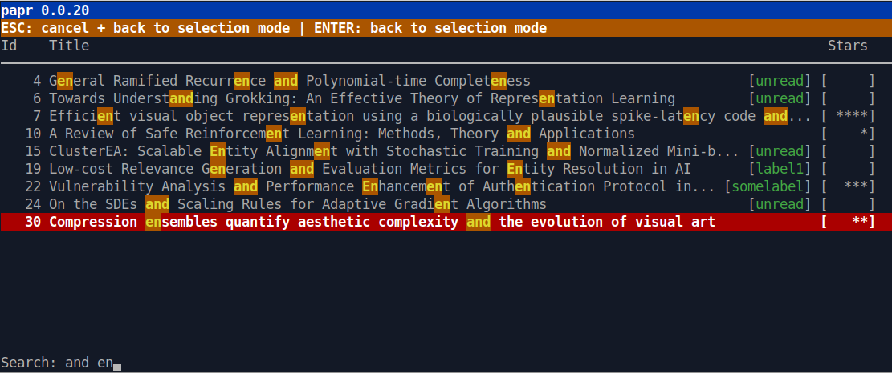

# Papr

Papr is a tool to manage and quickly access scientific papers on the command line.

**Features**

* **Fast search:** search in the title of papers via regular expressions or trigrams.
* **Notes:** create notes for each paper.
* **Rating of papers:** rate your papers via a five star rating system.
* **Tags:** assign each paper different tags.
* **Import from arXiv:** automatically import papers with title and abstract from arXiv

## Install

You can install papr via pip:

    pip install papr

## Getting started.

Papers are organized in repositories. To create a repository change into a directory where the repository should be created and type `papr init`. Example:

    cd astro_repo
    papr init

This will create a directory `.paper` in the `astro_repo` directory to store metadata. All PDFs will be stored in `astro_repo`.

**Default repositories**

The last repository which you create with `papr init` is set as the default repository. If you call `papr` without being in a repository the default repository will be used for all operations. Otherwise, the current working directory will be used as the repository.

**Fetch a paper from arXiv.org or OpenReview.net**

Fetching a document from arXiv is quite easy. You just have to provide the URL of the abstract and papr will
download the PDF and will automatically extract the title and abstract. Example:

    papr fetch https://arxiv.org/abs/1812.07561

The same does also work for papers on OpenReview.net:

    papr fetch https://openreview.net/forum?id=HkNDsiC9KQ

**Run**

When you have added papers to your repository you can run papr by simply executing:

    papr

You will see your list of papers through which you can navigate.

**Further information**

Run `papr --help` for further information.

## Key shortcuts

* h: Help / List of key bindings.
* q / ESC: Quit.
* ENTER: Open the paper in a PDF reader.
* a: Show abstract for paper.
* i / Arrow up: Move selection up.
* k / Arrow down: Move selection down.
* s: Live search in title.
* r: Live search in title via regular expression.
* n: Edit notes.
* t: Edit tags.
* 0..5: Set voting.
* y: Show all stored information about a paper.
* l: Show statistics about tags.
* f: Filter (e.g. by tags).
* F: Clear filter.
